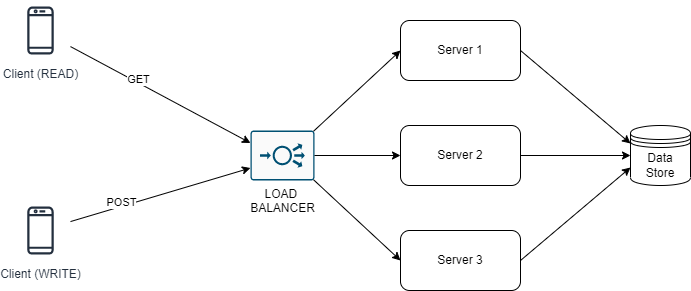

<!--

-->

# Case

we imagine that we have `100,000,000` offers and that we have `1000` new offers arriving per second. What
do you implement knowing that we want the result of exercise n°1 in near real time?

### Design Requirements and Assumptions

- Our service is used world wide. (Assumption)
- Given a location by a client or user, our service should figure out certain number of nearby locations. (Assumption)
- The infrastructure should be reliable.(Assumption)
- The system should response ≤ 200 milliseconds. So designing for latency is a big concern here. (Assumption)
- 1000 write queries per second.
- Let's assume read requests will be 5x of write requests.
- Each offer will look like this

```
   {
      profession: string ,
      contract_type: string,
      name: sring,
      latitude: float,
      longitude:
    }
```

- As users grow in our system, the system should scale linearly without adding much burden.
- Clients are generally mobile clients, but web clients can also be there. (Assumption)

## Quantitative Analysis

Let's start with `100,000,000` exisiting records.

### Storage

As each offer is represented by `profession`, `contract_type`, `name`, `latitude`, and `longitutde`.

Let's assume some reasonablee numbers for all parameters:

```
   profession = 10 bytes
   contract_type = 1 byte,
   name = 100 bytes,
   latitude = 8 bytes,
   longitude = 8 bytes
```

So to store each record we needs at least: `(10 + 1 + 100 + 8 + 8) = ~127 bytes = ~100 bytes` say.

For 10 million records to start with, we need: `10 * 10⁶ * 100 bytes = 1 Gigabytes`.

With a growth rate of 1000 per secs,

```
    new data per day = 86,400,000 request *  100 bytes = ~ 8.64 Gigabytes = ~ 8 Gigabytes
    new data per month = 8 Gigabytes * 30 days = 240  Gigabytes = ~200 Gigabytes
```

Assuming that each new record will stay for 1 month, and With a growth rate of 25% each year, if we plan for say 5 years, we need to have support for:

```
    1st Year: 200 Gigabytes
    2nd Year: (200 + 200 * .25) = 250 Gigabytes
    3rd Year: (250 + 250 * .25) = ~300 Gigabytes
    4th Year: (300 + 300 * .25) = ~375 Gigabytes
    5th Year: (375 + 375 * .25) = ~450 Gigabytes
```

Just to store the record in our data store, we need a bare minimum store of `450 Gigabytes` remember we may need more storage actually depending on what other metadata / auxiliary information we may need to store depending on our use cases or what metadata our data store internally stores in order to facilitate search or query operation on the data stored. So let’s extrapolate the the storage to a minimum of `500 Gigabytes`.

So how many machines we need to store `500 GB` of data? -> Modern day, there are many database machine types (in AWS or Azure) which can offer storage from `16 TB to 64 TB` depending on cost & use cases. So ideally 1 machine should be enough to support our use case. But remember, with a higher growth rate or with increasing popularity, we may need more storage or more machines. Nevertheless, we will design our infrastructure to support horizontal scaling.

### Read Heavy vs Write Heavy System?

Our requirement already specifies that we have assumed that read is `5x` of write. So it’s already established that our system is extremely read heavy & the Read:Write ratio is `5:1`.

### Network Bandwidth Estimation

With 5000 read and 1000 write requests, Each read request will contains 10 records (pagesize = 10).

- `content-lenth` of read request `(10 records * 100 bytes) + ~800 bytes request meta = ~ 1800 bytes `
- `content-lenth` of write request `(1 records * 100 bytes) + ~800 bytes request meta = ~ 900 bytes `

```
data tranfer per secs = (5000 read requests * 1800) + (1000 read requests * 900) = 9.9 Megabyte = ~10 Megabyte
```

### Network Protocol Choice

we have assumed to support web & mobile clients, we need to choose a protocol which is developer friendly, easy to use & understand as 3rd party developers need to integrate with our infrastructure. There are couple of options like — SOAP, RESTful API over HTTP or RPC API.

- **SOAP**: It’s quite old & complex to understand, pretty nested schema & typically XML is used to express the request & response. It’s not very developer friendly as well. We won’t choose SOAP.

- **RPC**: It’s good for use cases suitable for communication in the same data centre & RPC requires client & server side stubs to be created which makes them tightly connected. Changing the client-server integration will be painful in case there is any need. So we won’t choose it.

- **RESTful with HTTP**: This is something which nowadays has become the de-facto standard. It’s developer friendly, mostly developers use JSON schema to express request / response which is well understood in the community, easy to integrate & introduce new API version when required. For these reasons, we will go ahead with designing our API as RESTful API using HTTP.

### Database Schema

- Since our data is static, it makes sense to put data into a data store since these locations are mostly static.
  On other hand If it will be very dynamic like cab’s location or delivery boy’s location & those locations constantly get pushed to your system, it does not make sense to store them in persistent data store unless we want to enable tracking for this or that purpose.

### High Level Design (HLD)

<p align="center">
  
  <h4 align="center">High Level Design<h4>
</p>

#### Load balancer

- Considering in the worst case all the traffic come from the same region, it will be difficult for a single server to manage that load. So we need stateless application servers which can share the load among themselves. Hence the load balancer comes into action.
